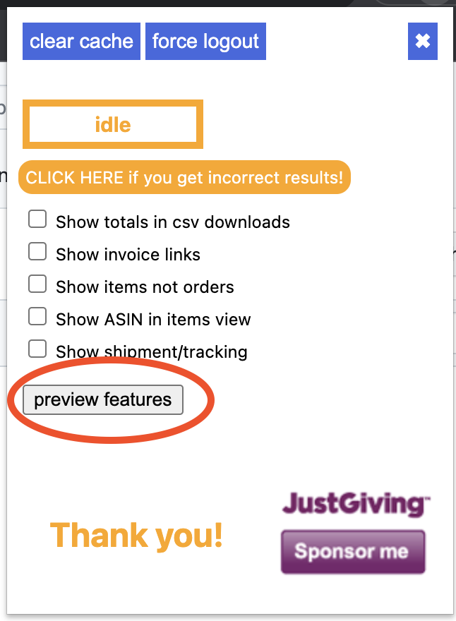
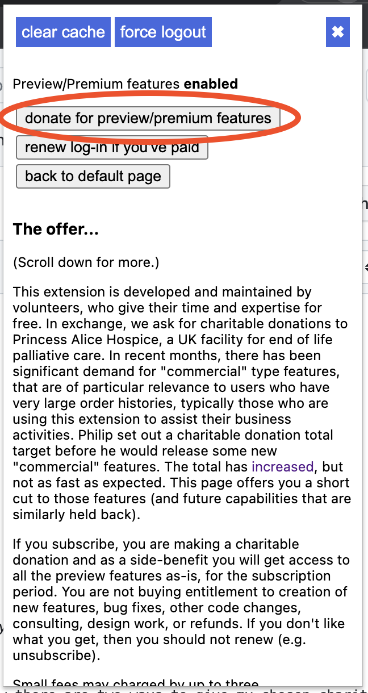

# Azad: amazon order history reporter chrome extension

## Official installation page
https://chrome.google.com/webstore/detail/amazon-order-history-repo/mgkilgclilajckgnedgjgnfdokkgnibi

## Quick Start Instructions
1) Install the extension from [here](https://chrome.google.com/webstore/detail/amazon-order-history-repo/mgkilgclilajckgnedgjgnfdokkgnibi).
2) (Optional) pin the extension icon in your browser by clicking on the jigsaw puzzle piece icon (high right in the chrome browser window), and then clicking on the pin next to "Amazon Order History Reporter", making the pin icon blue. This should permanently display the extension's orange A (for amazon) icon in your extension bar.
3) Navigate to one of the supported amazon sites, and make sure you're logged in to your amazon account on that page (so that the extension will be able to see your account data).
4) Click on the extension's icon (orange A) bringing up its pop-up/control panel.
5) Click on one of the year buttons to scrape and display a year's worth of orders. The extension updates scrape query statistics in the pop-up, so you can see how the fetching/scraping is progressing. At some point it will clear the amazon window and place an orange progress bar that grows until scraping is complete. The more orders you have, the longer it takes.
6) Sometimes, the extension will warn you you're [logged out](https://github.com/philipmulcahy/azad/edit/master/README.md#log-in-message). You may disagree and be able to navigate around your amazon stuff directly, but the warning has been generated because the site has responded to the extension's queries in a way that suggests that for at least some queries a log-out and log back in will help. The extension never sees your log-in credentials - you supply them directly to the Amazon page. The cookies that are set by Amazon enable queries sent by the extension to succeed, but the extension doesn't look at those cookies, store them, share them or misuse them in any way. This is by design - I am a single developer doing this on a voluntary basis, and haven't got time to be looking after sensitive user data, so I've gone around the problem by avoiding contact with it altogether.
7) The popup has various options you can use to control how it behaves. They are mostly self explanatory. Some of the controls show text help boxes if you point to them for a second or two.

## Commercial/Premium/Preview Features
Paywall subscription/donations count towards the total (less the fees that stripe and others charge).
As and when I develop new features, I may choose to put them behind the paywall for a time.

A clear(ish) signal emerged from a 2022 survey - here are the top two requested features:
1) Report ASINs, price, and quantity
2) Scrape specific month/quarter

I got these working and deployed them behind a preview subscription paywall in v1.9.26 in June 2023.
When a GBP 5000 charity goal was reached, they became free.

As of Jan 2024, only shipment/tracking data sits behind the paywall.

Check out [commercial_features.md](doc/commercial_features.md) for more detail. You need to actually subscribe to get the hidden features - giving directly to the JustGiving page will not work (though it all goes to the same charity destination). I am frequently assailed by folks who have given the minimum donation to the JustGiving page, and are angry that they have not been subscribed - I've put warnings similar to this one in all the places they will have passed on their route to doing the "wrong thing".

## Selected Feedback

* Thanks so much for your fine work on behalf of both PAH and Amazon users everywhere!
* I want to thank you for the plugin. It saved me hours of time. Thanks!
* I don't know how many man-hours Azad has saved me, but it's a lot, and I appreciate every one of them.  Thank you.  Please keep up the excellent work!  (BTW, your trouble-shooting tips work great!)
* Your Order History application is a great piece of coding & a HUGE time saver for everyone missing the facility Amazon so strangely removed & the PAH is a fantastic cause. Thank you !!!
* Happy to donate to a good cause and getting the help of Phillip's program is great. Saved me a lot of time
* Thank you for this app!  Philip's Amazon Order History Reporter is a game changer!
* I have a small business and find your tool invaluable for doing my VAT returns. Thank you for creating and maintaining it and for the very moving rationale behind your motivation for doing so.
* Thank you or saving me n entire night of digging through amazon's horrible purchase list!
* Thanks for the amazing Amazon Order History plugin. What an excellent cause as well.
* Thank you! First, for the great and useful tool you've created; second, for paying all that effort forward to something as meaningful and important as Princess Alice. You are a good man.
* Great extension. Saves a ton of time vs doing this manually. Amazon really is shafting their users here. One plus would to report the entire address or scape the postal code...

# Help!

## Common problems, with some fixes

*If you've not read through this document (and indicated that you've done so in the help request), your help ticket may be closed without further comment.*

### Subscribe to Premium features
### I Subscribed but I am not getting premium features

In order to subscribe, or even know there is a subscription option you probably paged past some text that explained how there are two ways to give to my chosen charity in order to support this extension.
The more prominent, older one is purely altruistic in nature, and does not give you access to the premium features, because I'd not figured out how to erect a paywall or even realised that it might be a good idea (commercial users used to contribute almost nothing).
The "subscription" option is a bit harder to find - because I wanted folks to read the notes about it (e.g. you get access to the premium features as they are, not necessarily as you would like them to be) before attempting to crucify me for bugs (there are some, and I put time into fixing them, but those motivated commercial users seem to mostly be content).
If you are reading this, it is possible that you handed over your money to charity via the first option (thanks), instead of the second.
Here are some screenshots (taken from v1.9.32, in September 2023) that show how to subscribe:
 

### I subscribed, but I don't want it to renew

Thank you!
This [article](https://github.com/philipmulcahy/azad/issues/264) explains how to unsubscribe.

### No orange year buttons showing in the extension popup

You should check that you've followed the [quick start instructions](https://github.com/philipmulcahy/azad/blob/master/README.md#quick-start-instructions). In particular the bit about being on a logged-in amazon page before you open the extension pop-up. If the extension can't see your amazon account, then it cannot know which years you've got orders in.

### No orders shown even though you know there should be some

Clear amazon cookies: open chrome://settings/siteData and type amazon in the search box, then delete them all. This will log you out.
Then log back in and try again.

### Out-of-date cache data

#### How could this have happened to me?

Maybe a new version of the extension has broken how the cache data is interpreted, or Amazon has changed their website breaking compatibility between the cached data and the live site (the cached data contains amazon generated urls).

#### What's the workaround?

If the extension is working, stop it by pressing the stop button.
Then click the "Clear Cache" button and resume normal use.

### Log-in message

Parts of Amazon's websites appear to have defences against denial of service or site scraping attacks.
If the extension needs to make a lot of requests (because you've got lots of orders or you choose many years, then it can log you out. This often happens only for types of orders or types of order related pages (payments, details) etc, leaving the other types of pages functional. The extension detects this and opens up a new sign-in page so you can log back in.
Once you've done this, you can restart the year fetch - it should avoid re-fetching stuff it's already put in the cache.

### Stuck progress in popup status/statistics

Symptoms: pending task count sticks at a non-zero number for many seconds.
I don't understand why this happens, but the workaround that has always worked for me is to remove all amazon cookies (this will log you out) and then everything works again.
If you look in the extension logs (see below), a clue that this is appropriate is entries in the log that complain about too many redirections.

### Amazon changed their site, or there are aspects of your orders that the developers have not seen before

The extension needs to be updated by developers to learn the new layout.

Please check to see that no-one else has filed a ticket for the same problem. If they have, join in the fun on that ticket rather than making your own "me-too" ticket.

At some point you're going to need to work with us by providing debug data (logs, order debug json files and screenshots) and testing experimental versions of the extension. I don't have direct access to your orders (or likely your country's version of Amazon), so if you're not willing to help, please don't waste everybody's time with a ticket - your issue cannot be fixed without your help.

### You've got a country+order_type combination we've not got test data for

See Amazon changed their site above.

## Generic work-arounds

Your first step should be to go to chrome://extensions and click Update.
After you do this, close and reopen the Amazon page and rerun the report to see if that helped.

Next, open chrome://settings/siteData and type amazon in the search box, then delete them all. This will log you out.
This is particularly useful for fixing problems where it looks like the extension got stuck/bored - sometimes Amazon starts giving the extension the run-around with infinite redirect links. Deleting cookies and logging back in seems to work. You don't need to delete non-amazon cookies.

Please go to https://github.com/philipmulcahy/azad/issues to see issues which have already been reported.

If you believe that you have the same issue, please add a comment.
If the issue you have seems new, please create a new issue and describe what you see and what you expect to see.

Either way, please include the Amazon address, such as https://www.amazon.com/gp/your-account/order-history

This serves two purposes:
* You'll be notified of updates.
* The project owner will be able to contact you for more information, if needed.

Before you send log files, debug info, or screenshots, please be aware that postings on GitHub are NOT private.
If you have log files, debug info, or screenshots to send but don't want them to be public, you can send them to azadextension@gmail.com with the ticket number in the email subject, and update the ticket to say you've sent such an email. The email inbox is not monitored: I only look at it when I am pointed there by a github ticket I have chosen to work on.

* Log files are usually free of personal info except if you include the most verbose filter settings - sometimes this is necessary, in which case send them by email rather than attaching them to a ticket post.
* Screenshots can be edited with a image editor to overwrite anything you don't want public, such as name, address, product description, or last 4 digits of credit card numbers. If you choose to send them to the azad email, you don't need to redact: I won't share them with the whole internet.
* Debug info contains info you'd probably want kept private (though we've not seen any credit card info), so don't post it on GitHub.

#### How to save a log file

* On the screen showing the report, press Ctrl+Shift+I (Cmd-Opt-I on MacOs) to open Chrome Developer Tools
* The Console log might appear at the bottom of the screen, but if it doesn't press "Console" (near to top of the tools pane)
* Once the console is open, select all logging levels: 
* Do your thing with the extension, reproducing whatever behaviour you want to capture.
* If you command a scrape and only then open the console, you'll probably only get the last few hundred lines of log. I think this is to save memory, so remember to follow these instructions in their entirety.
* RIGHT-click on the log pane and select "Save as..."
* Save the file as desired.
* If you're sending me (Philip) your log file, you should not attach it to a github ticket for all to see if you have scraped amazon transactions during the logged session, because it might well contain personally identifiable information (PII).
* Instead, send it to azadextension@gmail.com with the github ticket number somewhere in the subject line. This will avoid any of your PII being exposed for the world to see. Also please post a note on the github ticket to let me know to look out for it: I don't habitually look at project email unless I know there's something there for me: it's too full of proposals to buy the extension by folks who want to serve malware.

#### How to save and send an order debug json file

* You can only do this when you see the results table.
* RIGHT-click on the order ID link (in the order id column) for the row with the issue.
* Select "save order debug info".
* The debug info should automatically save to your downloads folder.
* DO NOT attach this file to a github ticket - although it doesn't contain passwords or full credit card numbers, it is likely to contain your name and address and some details of stuff you've ordered. Instead, send it to azadextension@gmail.com with the subject line including the ticket link. I (Philip) do not monitor this email address so you should also post on the ticket to say you've emailed a json file.
* Q: Who gets to see my data?
* A: The developer of the extension and possibly a small group of collaborators. The data is kept in a private repo whose maximum number of developers is limited to 10. Currently only one collaborator has access.
* Q: Why do you keep the data?
* A: To ensure that the fixes we prepare using your data stay fixed (known as a regression test).

#### How to try out an experimental version

This may be necessary if you are sent a link to a zip file (probably something like https://mulcahyfamily.org/azad/azad_12345678.zip)

1) Download the zip file
2) Unzip it to a folder
3) Open chrome://extensions/
4) Set "Developer mode" (slider in top right hand corner)
5) Disable any existing installed Amazon Order History Reporter extension - you don't want two of them fighting (slider in bottom right of the extension's tile).
6) Click "Load unpacked" (top left)
7) Navigate to the azad folder you unzipped in step (2)
8) Open an Amazon tab and start testing.
9) Remember to uninstall or disable the test version once you've finished playing. It will not automatically update with fixes, unlike the chrome web store version.
