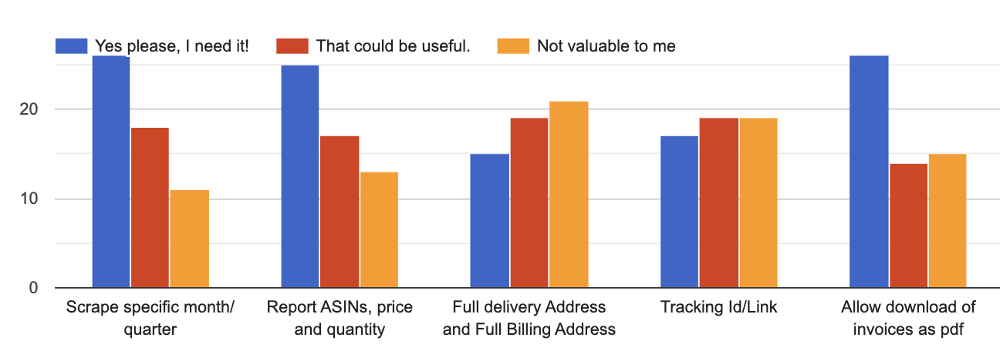
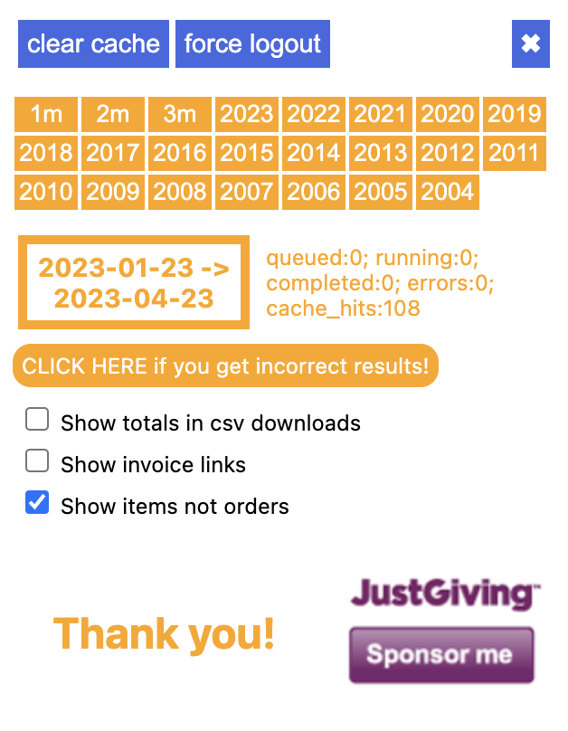

## Headline
Item ASIN, Item Quantity and scraping only the most recent 1, 2 or 3 months are all ready to be released.

I will release these features when https://www.justgiving.com/fundraising/azad-pah reaches £5000.

## Rationale

These features are primarily of interest to commercial users such as drop shippers and purchasing departments of companies. Such commercial usershave not been reticent in asking for me to add these (and other) capabilities.

Princess Alice Hospice (PAH) is a charity funded end-of-life care facility. I ask users who benefit from AZAD to donate to PAH using [this link](https://www.justgiving.com/fundraising/azad-pah/donate), instead of rewarding me. I have a day job and cannot accept compensation for out-of-hours work.

As I write this note in April 2023, the lifetime total raised by AZAD for PAH is £3306 (that's roughly USD 4100).

The value of the time I have invested in AZAD vastly exceeds this amount, and while I cannot be sure, it seems reasonable to suppose the value various businesses have derived from using it also much bigger.

## Survey Results:
In 2022, I put out a survey asking for commercial users to vote on what features they would find most valuable.

## Features Built and Ready to Go

I have built two of the most popular features:
|#|Feature|Details|JustGiving total threshold|
|-|-------|-------|--------------------------|
|1|Fetch only the first 1, 2 or 3 months.|<table><tr><td>Here's a screenshot of the upgraded control popup:</td></tr><tr><td></td></tr></table>|£5000|
|2|Fetch and display ASIN, Quantity and Price in the items table.| |£5000|
